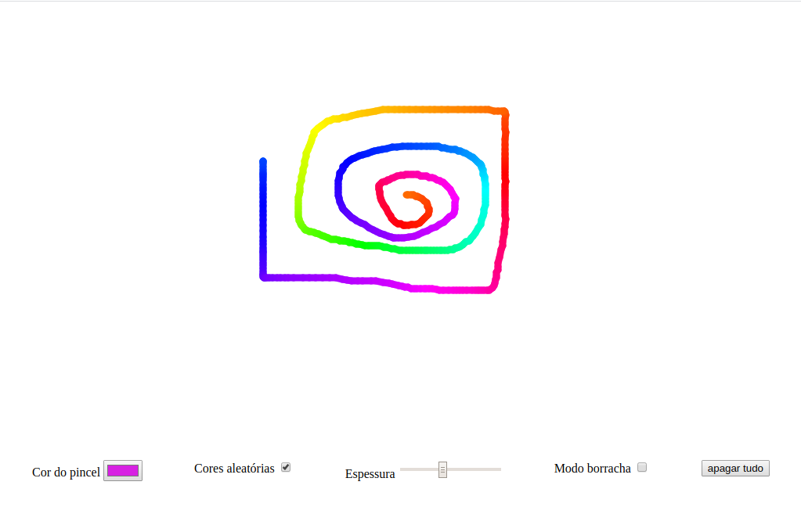

# Paint Online

A simple painting area written in javascript, using canvas.



The application has some settings such as:
- Brush thickness
- Rubber mode
- Random colors
- Erase everything
- Change brush color

###Technologies used:
* [Node] -  to create the server
* [Canvas] - for drawing
* [Javascript] - for animation and interaction

### Installation

You will need [Node.js] (https://nodejs.org/) v8 + to run.

Download the github code with:
```sh
$ git clone https://github.com/wandersonsousa/pain-canvas.git
```
Enter the project folder and enter the following command to install the dependencies:
```sh
$ npm install
```

Now to start the application just type:
```sh
$ npm start
```
``In the browser, go to localhost: 3001 and enjoy !``


# Feel free to help the project :)

   [node.js]: <http://nodejs.org>


